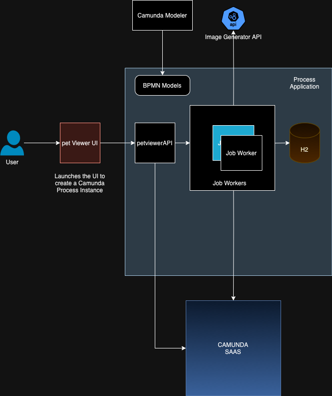
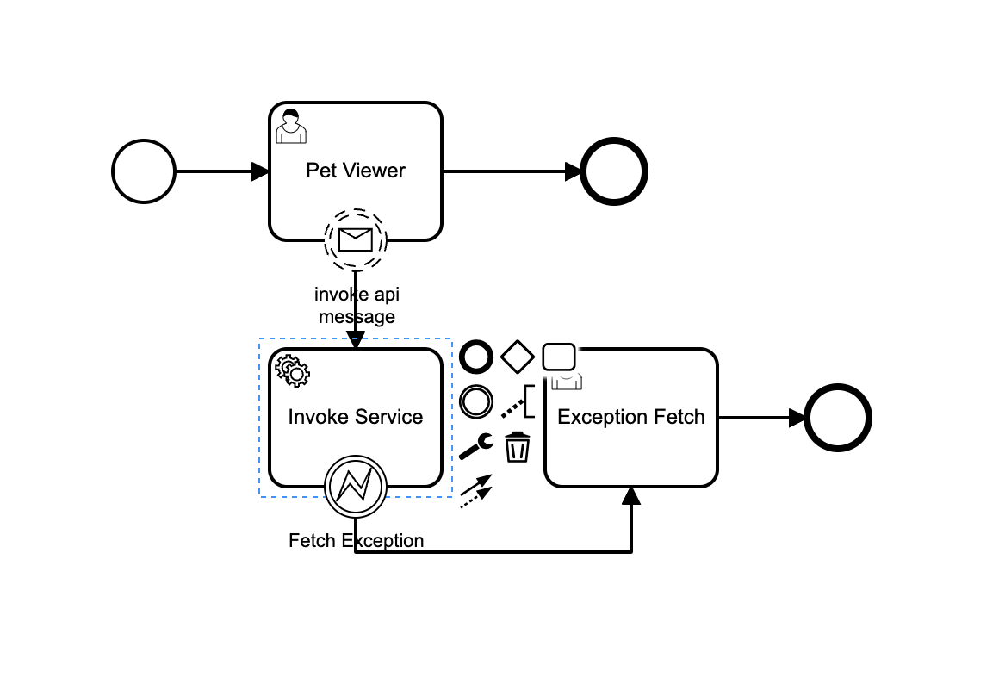

# Pet Viewer API in Camunda Platform 8

## Application System Design


## Pet Viewer Process Controller

This section of the document describes the ProcessController used in the Pet Viewer application. This controller interacts with Zeebe, a workflow engine, to manage process instances and message publishing.

Functionality

Starts process instances in Zeebe based on provided variables.
Publishes messages to Zeebe with correlation keys and variables.
Retrieves image data from the ImageRepository based on correlation key (for specific functionality).
Endpoints

[/process/start] (POST): Starts a process instance in Zeebe. Requires a ProcessVariables object in the request body.
[/process/message/{messageName}/{correlationKey}] (POST): Publishes a message to Zeebe with the specified name, correlation key, and variables.

## Pet Viewer Job Creator

Functionality

Connects to a Zeebe cluster using provided credentials.
Creates a worker for the specified job type.
Waits for incoming jobs and processes them using the ExampleJobHandler.
Terminates the worker upon receiving the exit command ("exit") through standard input.
```

## ImageController: 
[/animal/{type}/{businessKey}] (GET): Retrieves a random animal image of the specified type (cat, dog, or bear) with a unique business key.

Interacts with the ImageService (assumed to be a separate service) to:
Save the image data.
Retrieve the saved image by business key (optional).


## Camunda zeebe Cluster Configuration

Zeebe Cloud Configuration

These properties define the connection details for your Zeebe cloud deployment:
##### zeebe.client.cloud.region: 
configured in Application Properties file (e.g., jfk-1).
##### zeebe.client.cloud.cluster-id: 
configured in Application Properties file
##### zeebe.client.cloud.client-id: 
configured in Application Properties file
##### zeebe.client.cloud.client-secret: 
configured in Application Properties file

### Build the docker image
```
docker build -t pet-viewer .
```

## Tests Using Junit

- [Case Creation] Checks if the case is created sucessfully
- [Message Publish]Publishes the message to Zeebe

## How to Run
The App has a dockerfile that can be used to run the app in a container 
Also this can be executed locally by changing the Camunda zeebe Cluster Configuration in the application.properties file to any camunda cluster.


## BPMN

